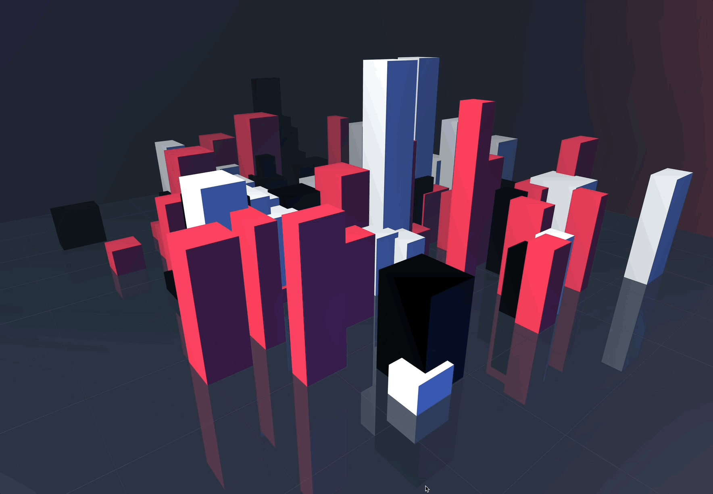
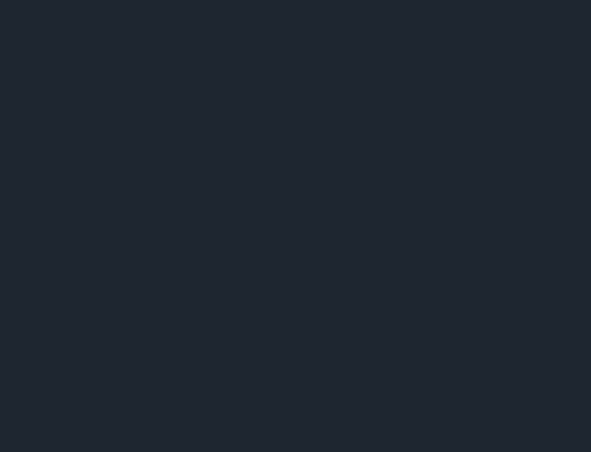
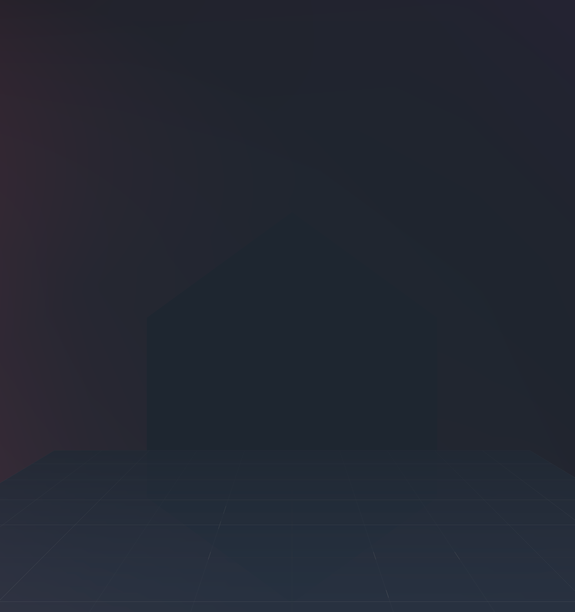
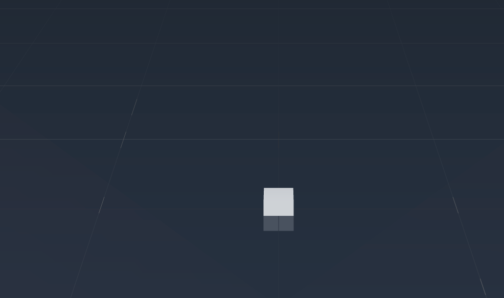
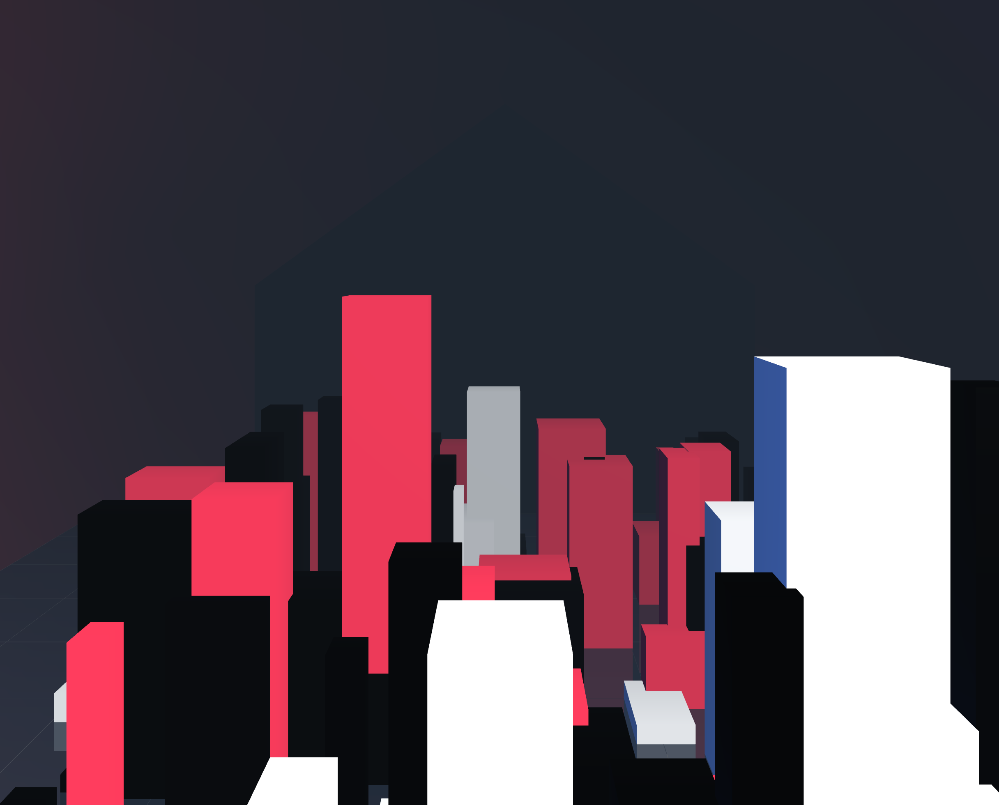

# 3D 城市动画实战教程

## 使用 Three.js 和 GSAP 创建动态城市场景

今天演示一个基于 Three.js 和 GSAP 的 3D 城市动画场景。它将从初始化一个空白的 3D 世界开始，逐步添加灯光、地面、建筑，并最终为它们赋予动态效果。



## 第一步：准备 HTML 结构

任何 web 项目都需要一个 HTML 文件作为入口。对于 Three.js 场景，需要一个 `<div>` 元素来容纳渲染结果，并需要通过 `<script>` 标签引入 Three.js 库和 GSAP 动画库。

```html
<!DOCTYPE html>

<html lang="en">
  <head>
    <title>3D City</title>
    <style>
      body {
        margin: 0;
      }
      #container {
        display: block;
      }
    </style>
  </head>

  <body>
    <div id="container"></div>

    <!-- 引入外部库 -->
    <script src="https://cdnjs.cloudflare.com/ajax/libs/three.js/r128/three.min.js"></script>

    <script src="https://cdnjs.cloudflare.com/ajax/libs/gsap/3.9.1/gsap.min.js"></script>

    <!-- 引入主逻辑脚本 -->
    <script src="./index.js"></script>
  </body>
</html>
```

**代码说明：**

- `<div id="container"></div>`：这是 Three.js 场景的渲染目标容器
- `body { margin: 0; }`：清除默认的边距，确保 canvas 能够铺满整个窗口
- `<script>` 标签：分别从 CDN 加载了 Three.js 核心库和 GSAP 动画库，并链接到项目的 index.js 文件

## 第二步：初始化 3D 场景

搭建 3D 世界的第一步是准备三大核心组件：渲染器（Renderer）、相机（Camera）和场景（Scene）。它们共同构成了所有视觉元素的基础。

```javascript
// 渲染器设置

const renderer = new THREE.WebGLRenderer({ antialias: true });
renderer.setPixelRatio(window.devicePixelRatio);
renderer.setSize(window.innerWidth, window.innerHeight);
const container = document.getElementById("container");
container.appendChild(renderer.domElement);

// 相机设置

const camera = new THREE.PerspectiveCamera(
  60,
  window.innerWidth / window.innerHeight,
  1,
  1000
);

camera.position.set(0, 180, 400);

// 场景设置

const scene = new THREE.Scene();

// 渲染循环

function animate() {
  requestAnimationFrame(animate);
  renderer.render(scene, camera);
}

animate();

// 窗口大小调整处理

function onWindowResize() {
  camera.aspect = window.innerWidth / window.innerHeight;
  camera.updateProjectionMatrix();
  renderer.setSize(window.innerWidth, window.innerHeight);
}

window.addEventListener("resize", onWindowResize, false);
```

**代码说明：**

- `THREE.WebGLRenderer`：Three.js 的渲染器，负责将 scene 和 camera 的内容绘制到 HTML 的 `<canvas>` 元素上。`antialias: true` 开启了抗锯齿效果
- `THREE.PerspectiveCamera`：透视相机，模拟人眼观察世界的方式，具有近大远小的效果
- `camera.position.set()`：设置相机在 3D 空间中的坐标
- `THREE.Scene`：场景是所有 3D 对象的容器，例如模型、灯光和辅助对象
- `requestAnimationFrame(animate)`：创建一个持续渲染的循环，确保场景内容在每一帧都被重新绘制，从而实现动画效果
- `onWindowResize`：这是一个响应式设计的关键函数，当浏览器窗口大小变化时，它会同步更新相机的宽高比和渲染器的尺寸，防止画面变形

> **提示：** 当前项目已可运行，请运行项目查看效果，并视情况截图记录。

## 第三步：布置核心场景元素

一个纯黑的场景无法观察到任何物体。需要添加雾效和光照，来定义场景的氛围和可见性。雾效可以增加景深感，而光照则决定了物体表面的明暗和色彩。

```javascript
// ... (前序代码) ...

const scene = new THREE.Scene();
scene.fog = new THREE.FogExp2(0x1e2630, 0.002);
renderer.setClearColor(scene.fog.color);

// 光源设置

const mainLight = new THREE.DirectionalLight(0xffffff, 2);

mainLight.position.set(1, 1, 1);

scene.add(mainLight);

const secondaryLight = new THREE.DirectionalLight(0x002288, 1.5);

secondaryLight.position.set(-1, -1, -1);

scene.add(secondaryLight);

scene.add(new THREE.AmbientLight(0x404040));

// ... (后续代码) ...
```

**代码说明：**

- `scene.fog`：为场景添加了指数雾 (`FogExp2`)。它模拟了大气效果，远处物体会逐渐融入雾色
- `renderer.setClearColor()`：将渲染器的背景色设置为与雾相同的颜色，使场景融合得更自然
- `THREE.DirectionalLight`：平行光，模拟像太阳光一样的光源，光线是平行的。此处设置了主光源和辅助光源，分别从不同方向和颜色照射，以增加场景的立体感
- `THREE.AmbientLight`：环境光，为整个场景提供一个基础的、均匀的光照，可以柔化阴影，确保场景最暗的部分也不是纯黑色



## 第四步：构建场景地理环境

有了基础环境，接下来需要为城市添加背景和地面。这里将使用一个巨大的几何体作为天空背景（穹顶），并用一个平面作为地面。

```javascript
// ... (前序代码) ...

// 穹顶创建

const domeGeometry = new THREE.IcosahedronGeometry(700, 1);

const domeMaterial = new THREE.MeshPhongMaterial({
  color: 0xfb3550,
  flatShading: true,
  side: THREE.BackSide,
});

scene.add(new THREE.Mesh(domeGeometry, domeMaterial));

// 地面创建

const groundGeometry = new THREE.PlaneGeometry(600, 600);

const groundMaterial = new THREE.MeshPhongMaterial({
  color: 0x222a38,
  transparent: true,
  opacity: 0.8,
  flatShading: true,
  side: THREE.DoubleSide,
});

const ground = new THREE.Mesh(groundGeometry, groundMaterial);

ground.rotation.x = Math.PI / 2;

scene.add(ground);

// 网格辅助线

scene.add(new THREE.GridHelper(600, 10));

// ... (后续代码) ...
```

**代码说明：**

- `THREE.IcosahedronGeometry`：一个由 20 个等边三角形组成的多面体。通过将其放大并设置 `side: THREE.BackSide`，可以创建一个包裹整个场景的穹顶作为天空
- `THREE.PlaneGeometry`：一个简单的二维平面。通过 `rotation.x` 将其旋转 90 度，使其水平放置，作为地面
- `flatShading: true`：这种材质属性会使模型的每个面都使用单一颜色进行着色，产生一种低多边形（Low Poly）的艺术风格
- `THREE.GridHelper`：在场景中创建一个网格平面，它对于在开发阶段观察物体的位置和尺寸非常有帮助



## 第五步：程序化生成建筑群

城市的核心是建筑。手动创建大量建筑非常低效，更好的方法是程序化生成。通过循环，可以快速创建一组位置和样式各异的建筑。

```javascript
// ... (前序代码) ...

// 建筑物生成

const geometry = new THREE.BoxGeometry(10, 10, 10);
const colors = [0xfb3550, 0xffffff, 0x000000];
const buildings = [];

for (let i = 0; i < 100; i++) {
  const material = new THREE.MeshPhongMaterial({
    color: colors[Math.floor(Math.random() * 3)],
    flatShading: true,
  });

  const building = new THREE.Mesh(geometry, material);

  buildings.push(building);
  scene.add(building);
}

// ... (后续代码) ...
```

**代码说明：**

- `THREE.BoxGeometry`：立方体几何体，作为所有建筑的基础形状
- `for` 循环：循环 100 次以创建 100 个建筑物
- `buildings` 数组：创建一个数组来存储所有建筑物的实例。这对于后续统一管理和执行动画至关重要
- `Math.random()`：通过随机函数从预设的 colors 数组中为每个建筑选择一个颜色，增加了视觉的丰富性
- `scene.add(building)`：在每次循环中，将新创建的建筑网格（Mesh）添加到场景中



## 第六步：添加建筑动画

静态的城市缺乏活力。使用 GSAP 动画库，可以为建筑物的尺寸和位置添加动态变化，使整个城市场景变得生动。

```javascript
// ... (在 animate() 函数之前定义) ...

// 动画系统

function startAnimation() {
  function animateLoop() {
    buildings.forEach((building) => {
      const duration = Math.random() * 0.6 + 0.3;
      const specialHeight = Math.random() < 0.1 ? 15 : 0;

      // 缩放动画

      TweenMax.to(building.scale, duration, {
        x: 1 + Math.random() * 3,
        y: 1 + Math.random() * 20 + specialHeight,
        z: 1 + Math.random() * 3,
        ease: Power2.easeInOut,
      });

      // 位置动画

      TweenMax.to(building.position, duration, {
        x: -200 + Math.random() * 400,
        z: -200 + Math.random() * 400,
        ease: Power2.easeInOut,
      });
    });

    // ... 暂未完成 ...
  }

  animateLoop();
}

// ... (在代码末尾调用) ...

startAnimation();
```

**代码说明：**

- `startAnimation` 与 `animateLoop`：定义了一个独立的动画逻辑。`animateLoop` 会被重复调用，以实现循环动画
- `TweenMax.to()`：这是 GSAP 库的核心函数，用于创建补间动画。它会在指定的 duration (时长) 内，将目标对象的属性平滑地过渡到指定值
- `building.scale`：控制建筑物的缩放。通过随机改变 x, y, z 值，使建筑产生高低胖瘦不一的生长效果
- `building.position`：控制建筑物的位置。通过随机改变 x, z 坐标，让建筑在地面上随机移动
- `ease: Power2.easeInOut`：定义动画的缓动函数，使动画过程看起来更自然，具有加速和减速的效果



## 第七步：实现相机环绕动画

为了更好地展示整个动态城市，需要让相机也运动起来。通过 GSAP，可以实现相机围绕场景中心进行平滑、随机的环绕飞行。

```javascript
// ... (在相机定义之后) ...

camera.animAngle = 0; // 自定义属性：用于动画中的角度计算
camera.position.set(
  Math.cos(camera.animAngle) * 400,
  180,
  Math.sin(camera.animAngle) * 400
);

// ... (在 animateLoop 函数内部) ...

function animateLoop() {
  // ... (建筑物动画代码) ...

  // 相机动画

  TweenMax.to(camera, 1.5, {
    animAngle: camera.animAngle + (Math.random() - 0.5) * 2 * Math.PI,
    ease: Power1.easeInOut,
    onUpdate: () => {
      camera.position.x = Math.cos(camera.animAngle) * 400;
      camera.position.z = Math.sin(camera.animAngle) * 400;
      camera.updateProjectionMatrix();
      camera.lookAt(scene.position);
    },
  });

  // 循环控制

  TweenMax.to(window, 3.5, { onComplete: animateLoop });
}
```

**代码说明：**

- `camera.animAngle`：在相机对象上附加一个自定义属性，专门用于控制其在圆形轨道上的角度。直接对 position 做动画会产生不自然的直线运动
- `Math.cos()` & `Math.sin()`：利用三角函数，将 animAngle 角度转换为 (x, z) 坐标，从而实现完美的圆形路径运动
- `onUpdate`：这是 GSAP 动画过程中的一个回调函数。在 animAngle 变化的每一帧，它都会被调用，用于实时更新相机的位置
- `camera.lookAt(scene.position)`：确保相机在运动过程中，始终朝向场景的中心点（坐标 0,0,0），保持焦点稳定
- `TweenMax.to(window, 3.5, { onComplete: animateLoop });`：这是一个巧妙的延迟调用。它创建了一个不产生任何视觉效果的动画，仅利用其 onComplete 回调，在 3.5 秒后再次触发 animateLoop 函数，从而实现整个动画序列的无限循环

## 总结

通过本教程，我们学习了：

- Three基础场景.js 的搭建（渲染器、相机、场景）
- 使用雾效和光源营造氛围
- 程序化生成大量建筑物
- 使用 GSAP 实现建筑物动画
- 实现相机环绕动画

## 完整代码

**GitHub**：https://github.com/zhouxun0803/threejs-demo/tree/main/city
