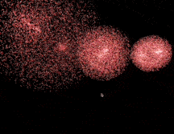

# 烟花

## 使用 Three.js 创建烟花粒子特效教程

今天，我们将使用 Three.js 来实现一个简单而美观的烟花粒子效果。烟花会在屏幕随机位置生成，粒子在爆炸后呈现出散射、下降、逐渐消散的动态效果。先来看一下效果。



## 第一步：搭建基础场景

在正式实现烟花效果前，我们需要一个可以显示内容的 Three.js 场景。以下代码实现了最基本的场景、相机和渲染器设置。

```javascript
import * as THREE from "three";

// 场景设置
const scene = new THREE.Scene();
const camera = new THREE.PerspectiveCamera(75, window.innerWidth / window.innerHeight, 0.1, 1000);
const renderer = new THREE.WebGLRenderer({ antialias: true });
renderer.setSize(window.innerWidth, window.innerHeight);
document.body.appendChild(renderer.domElement);

// 相机位置
camera.position.z = 50;
```

**代码逻辑说明：**

- `scene`：创建一个场景对象，是 Three.js 中所有 3D 元素的容器
- `camera`：创建透视相机，用于观察场景，参数：
  - `75`：视角（FOV）
  - `window.innerWidth / window.innerHeight`：宽高比
  - `0.1` 和 `1000`：相机的近、远平面
- `renderer`：渲染器将 3D 场景绘制到浏览器中
- 设置相机位置：通过 `camera.position.z` 拉远视角，确保看到整个场景

## 第二步：定义烟花粒子类

在这一步，我们将设计一个 Firework 类，用于模拟每个烟花的粒子效果。

一个烟花包含以下逻辑：

- **初始属性**：粒子的位置（positions）、速度（velocities）以及颜色（colors）
- **设置粒子生命周期**（life），用于控制粒子的消失
- **初始化粒子**：在烟花爆炸时，粒子会沿着随机方向散开
- **更新粒子状态**：粒子随着时间更新位置、缩小大小，并模拟重力作用
- **销毁粒子**：当粒子生命周期耗尽时，清除其资源

### 1. 定义类和基础属性

```javascript
class Firework {
  constructor(x, y, z) {
    this.geometry = new THREE.BufferGeometry(); // 几何对象存储粒子数据
    this.count = 10000; // 粒子数量
    this.positions = new Float32Array(this.count * 3); // 粒子位置
    this.velocities = []; // 粒子速度
    this.colors = new Float32Array(this.count * 3); // 粒子颜色
    this.sizes = new Float32Array(this.count); // 粒子大小
    this.life = new Float32Array(this.count); // 粒子生命周期
  }
}
```

**代码逻辑说明：**

- `positions`：粒子的 3D 空间坐标（x, y, z）
- `velocities`：粒子的速度向量，用于控制运动方向和速度
- `colors`：粒子的颜色，以 RGB 格式表示，每个粒子独立设置
- `sizes`：粒子的大小，用于动态变化
- `life`：生命周期，用于控制粒子消散

### 2. 初始化粒子数据

我们为每个粒子分配一个初始位置和随机运动方向。

```javascript
for (let i = 0; i < this.count; i++) {
  const phi = Math.random() * Math.PI * 2; // 水平方向角度
  const theta = Math.random() * Math.PI; // 垂直方向角度
  const velocity = 2 + Math.random() * 2; // 随机速度

  // 计算速度向量
  this.velocities.push(
    velocity * Math.sin(theta) * Math.cos(phi),
    velocity * Math.sin(theta) * Math.sin(phi),
    velocity * Math.cos(theta)
  );

  // 设置初始位置
  this.positions[i * 3] = x;
  this.positions[i * 3 + 1] = y;
  this.positions[i * 3 + 2] = z;

  // 设置颜色为红色调
  this.colors[i * 3] = 1.0; // 红色
  this.colors[i * 3 + 1] = Math.random() * 0.2; // 随机绿色偏移
  this.colors[i * 3 + 2] = Math.random() * 0.2; // 随机蓝色偏移

  // 初始大小和生命周期
  this.sizes[i] = 0.3;
  this.life[i] = 1.0;
}
```

**代码逻辑说明：**

- **随机方向**：通过球面坐标计算粒子散射方向
- **颜色随机性**：让每个粒子的颜色略有不同，使整体效果更自然
- **生命周期与大小**：初始化每个粒子的生命周期和大小，稍后会动态更新

### 3. 创建材质与几何

将粒子属性绑定到 Three.js 的 BufferGeometry 对象上，并为其定义材质。

```javascript
this.geometry.setAttribute("position", new THREE.BufferAttribute(this.positions, 3));
this.geometry.setAttribute("color", new THREE.BufferAttribute(this.colors, 3));
this.geometry.setAttribute("size", new THREE.BufferAttribute(this.sizes, 1));

const material = new THREE.PointsMaterial({
  size: 0.3,
  vertexColors: true,
  blending: THREE.AdditiveBlending,
  transparent: true,
  opacity: 0.8,
});

this.points = new THREE.Points(this.geometry, material);
scene.add(this.points);
```

**代码逻辑说明：**

- **几何属性**：通过 `setAttribute` 绑定粒子的位置、颜色和大小
- **粒子材质**：
  - `vertexColors: true`：允许粒子使用自定义颜色
  - `blending: THREE.AdditiveBlending`：粒子叠加效果
  - `transparent: true`：支持透明度设置
- **添加到场景**：通过 `scene.add` 将粒子效果添加到 Three.js 场景中

## 第三步：更新粒子状态

在这一步，我们将为粒子添加运动、重力效果，并实现逐渐消失的逻辑。粒子在其生命周期内会不断更新位置、大小和透明度，直至完全消散。

### 1. 更新粒子的逻辑

我们在 Firework 类中定义一个 update 方法，用于逐帧更新粒子状态。粒子的行为包括：

- **位置更新**：根据速度调整粒子位置
- **重力效果**：粒子会受到向下的重力作用
- **生命周期减少**：粒子逐渐消散
- **尺寸变化**：粒子大小随着生命周期减小

```javascript
update() {
  let alive = false; // 标记烟花是否仍然活跃

  for (let i = 0; i < this.count; i++) {
    if (this.life[i] > 0) {
      alive = true;

      // 更新位置
      this.positions[i * 3] += this.velocities[i * 3] * 0.1;
      this.positions[i * 3 + 1] += this.velocities[i * 3 + 1] * 0.1;
      this.positions[i * 3 + 2] += this.velocities[i * 3 + 2] * 0.1;

      // 添加重力效果
      this.velocities[i * 3 + 1] -= 0.05;

      // 减少生命周期
      this.life[i] -= 0.015;

      // 缩小粒子尺寸
      this.sizes[i] = this.life[i] * 0.3;
    }
  }

  // 更新几何数据
  this.geometry.attributes.position.needsUpdate = true;
  this.geometry.attributes.size.needsUpdate = true;

  return alive;
}
```

**代码逻辑说明：**

- **位置更新**：粒子会以其速度向指定方向移动，使用 `positions[i * 3 + j]` 更新每个轴的坐标
- **重力效果**：通过 `velocities[i * 3 + 1]` 对 y 轴速度施加一个固定的负值，模拟重力
- **生命周期和大小**：每帧减少 `life[i]`，模拟粒子的逐渐消失。粒子尺寸 `sizes[i]` 由生命周期决定，越接近结束越小
- **几何更新**：通过设置 `needsUpdate` 为 true 通知 Three.js 更新粒子属性

### 2. 清除已消散的粒子

当粒子完全消失后，我们需要将它从场景中移除，并释放相关的资源。在 Firework 类中，定义一个 dispose 方法：

```javascript
dispose() {
  scene.remove(this.points); // 从场景移除
  this.geometry.dispose();   // 释放几何资源
  this.points.material.dispose(); // 释放材质资源
}
```

## 第四步：管理烟花的生成与销毁

现在，我们有了基础场景和粒子类，接下来需要一个管理系统来：

- **随机生成烟花**：在随机位置创建新的 Firework 实例
- **逐帧更新所有烟花**：调用 update 方法并移除已消散的烟花
- **监听窗口变化**：确保画布始终适配窗口大小

### 1. 存储活跃烟花

创建一个数组 fireworks，用于存储当前所有的活跃烟花：

```javascript
const fireworks = [];

// 随机生成烟花
function createRandomFirework() {
  const x = (Math.random() * 2 - 1) * 30; // 随机 x 坐标
  const y = (Math.random() * 2 - 1) * 25; // 随机 y 坐标
  fireworks.push(new Firework(x, y, 0)); // 将新烟花添加到数组
}
```

### 2. 动画循环

在 animate 函数中，每帧执行以下操作：

- 随机生成新的烟花
- 更新现有烟花的状态
- 移除消散的烟花
- 渲染场景

```javascript
function animate() {
  requestAnimationFrame(animate);

  // 随机生成烟花
  if (Math.random() < 0.05) {
    createRandomFirework();
  }

  // 更新所有烟花
  for (let i = fireworks.length - 1; i >= 0; i--) {
    const alive = fireworks[i].update();
    if (!alive) {
      fireworks[i].dispose();
      fireworks.splice(i, 1); // 从数组移除已消散的烟花
    }
  }

  // 渲染场景
  renderer.render(scene, camera);
}
```

### 3. 窗口大小调整

为了适配不同设备，我们需要监听窗口大小变化并调整相机和渲染器：

```javascript
function onWindowResize() {
  camera.aspect = window.innerWidth / window.innerHeight;
  camera.updateProjectionMatrix();
  renderer.setSize(window.innerWidth, window.innerHeight);
}

window.addEventListener("resize", onWindowResize, false);
```

## 第五步：启动动画

最后，启动动画循环：

```javascript
animate();
```

此时，项目已经完成！运行代码后，你将看到屏幕上随机生成烟花，每个烟花都会散射出无数的粒子，粒子在运动过程中逐渐消失。

## 总结

到此，我们就完成了使用 Three.js 创建烟花粒子特效的教程。

## 完整代码

- **GitHub**：https://github.com/zhouxun0803/threejs-demo/tree/main/yanhua